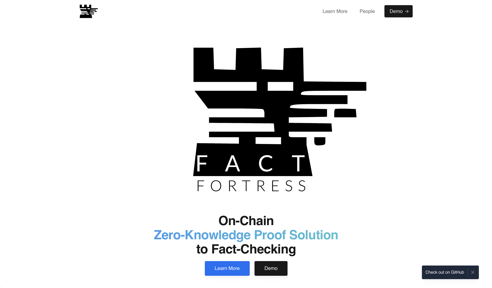
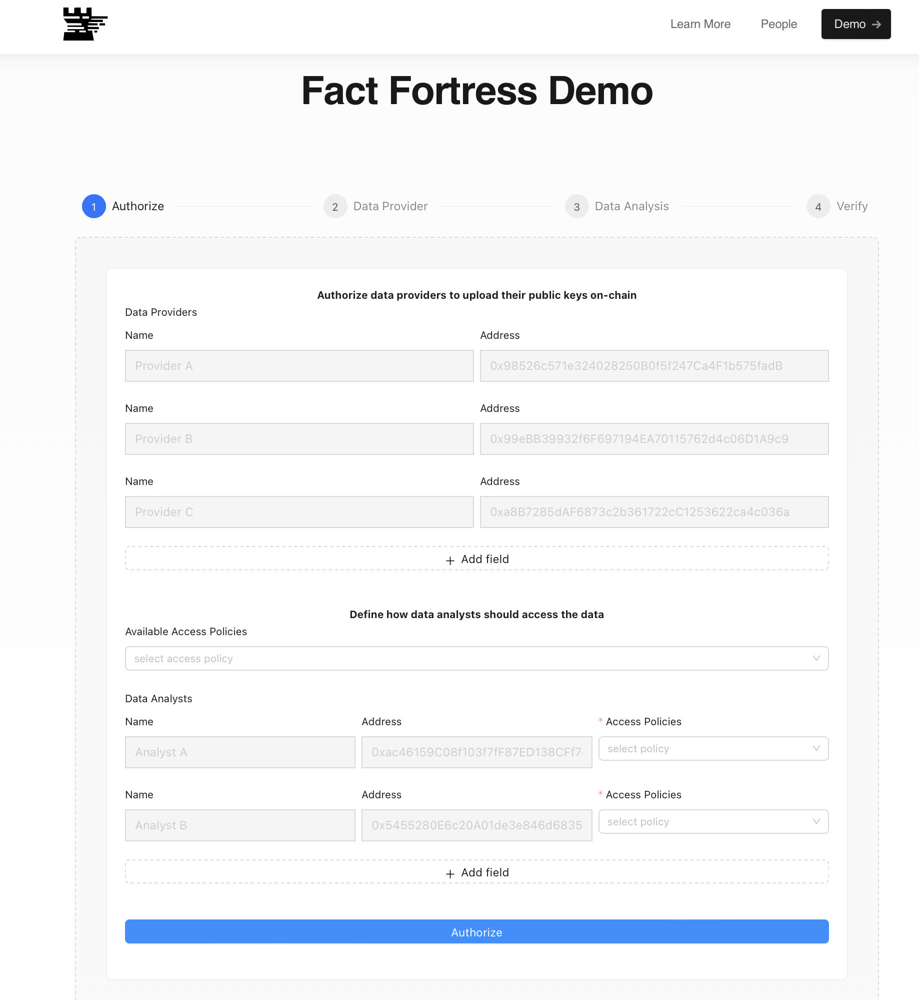

# Fact Fortress Web
<p align="center">
  
</p>

This repository contains the code for the front-end of Fact Fortress, including a demo for the back-end.

The static front-end for the demo is available on GitHub Pages at the following link: [https://pierg.github.io/fact-fortress-web/](https://pierg.github.io/fact-fortress-web/). To run the demo locally on your machine, please follow the instructions below.

<p align="center">
  
</p>


## What is Fact Fortress

Fact Fortress is a blockchain-based framework that uses zero-knowledge proofs for trustworthy and private fact-checking. It ensures trustworthy data handling and computation by using proofs of data provenance and auditable data access policies. The solution democratizes circuit construction and deployment with a circuit compiler that supports various data formats and source authentication, and facilitates on-chain verification. This preserves sensitive data privacy while ensuring accountability and transparency in data handling and computation. It achieves this by enabling on-chain verification of computation and data provenance without revealing any information about the data itself.


Our framework provides a comprehensive solution that covers the entire process from circuit generation to proof generation, while facilitating collaboration among data analysts, data providers, external verifiers, and policy auditors.


<p align="center">
  
</p>


For more information, check out our website at: [https://pierg.github.io/fact-fortress-web/](https://pierg.github.io/fact-fortress-web/).


## Demo 

<p align="center">
  
</p>


You can find a video showing how to use the demo on our website
[on our website](https://pierg.github.io/fact-fortress-web/demo) .


To run the demo, follow these instructions:


## Prerequisites

- NodeJS LTS [https://nodejs.org/en/download](https://nodejs.org/en/download)
- pnpm [https://pnpm.io/fr/installation](https://pnpm.io/fr/installation)
- make

Install the backend and the frontend:

```
git clone git@github.com:pierg/fact-fortress-dapp.git
cd fact-fortress-dapp && pnpm install
git clone git@github.com:pierg/fact-fortress-frontend.git
cd fact-fortress-frontend && pnpm install
```

## Run the Demo

### Run the DApp

To deploy the backend and the frontend together, run the following command from the root directory:

```
make run
```

This command launches the backend, then opens the frontend in the browser (`http://localhost:8080`).

### Independently run the backend

From the root directory, run:

```
pnpm backend
```

(By default, the backend runs on port `3000`).

A Postman collection is provided to interact with the backend: `tools/Postman_collection/Fact_Fortress.postman_collection.json`

### Independently run the frontend


*Once the backend is running* (`► server started on port 3000 ✓`), from the root directory run:

```
pnpm frontend
```

Then, open `http://localhost:8080` on your browser.

(By default, the backend runs on port `8080`).